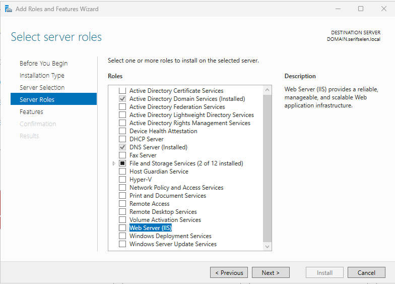
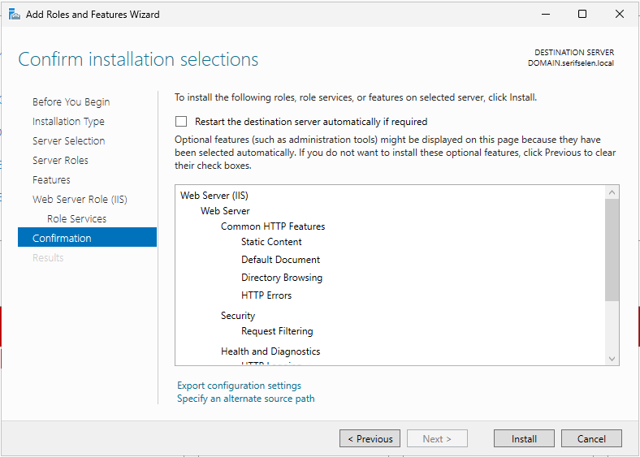
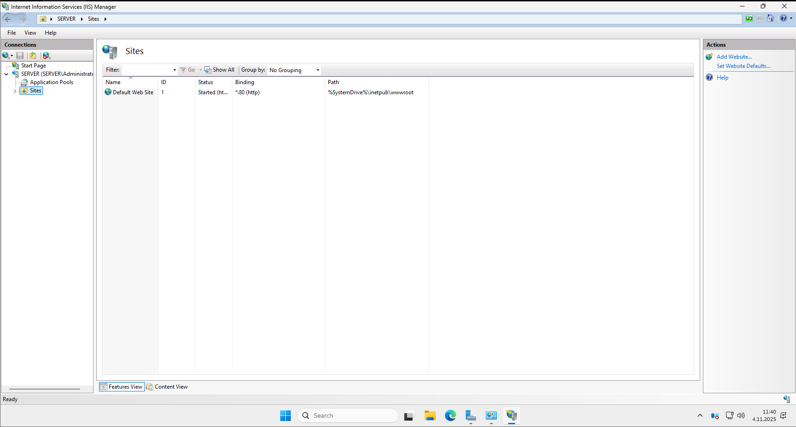

# IIS (Internet Information Services) Kurulumu ve Web Sitesi Yapılandırması
## Windows Server 2025 Üzerinde Web Server Rolü Kurulum Rehberi

Bu rehber, Windows Server 2025 Standard Evaluation sistemine IIS (Internet Information Services) Web Server rolünün nasıl kurulacağını ve web sitesinin nasıl yapılandırılacağını adım adım açıklar.

---

## 📑 İçindekiler

- [Kurulum Öncesi Hazırlık](#kurulum-öncesi-hazırlık)
- [IIS Rolü Kurulum Adımları](#iis-rolü-kurulum-adımları)
  - [Adım 1: Server Roles Seçimi - Web Server (IIS)](#adım-1-server-roles-seçimi---web-server-iis)
  - [Adım 2: Kurulum Onayı ve Yükleme](#adım-2-kurulum-onayı-ve-yükleme)
- [IIS Manager ve Web Sitesi Yapılandırması](#iis-manager-ve-web-sitesi-yapılandırması)
  - [Adım 3: IIS Manager Arayüzüne Erişim](#adım-3-iis-manager-arayüzüne-erişim)
  - [Adım 4: Yeni Web Sitesi Ekleme](#adım-4-yeni-web-sitesi-ekleme)
- [Kurulum Sonrası Test ve Doğrulama](#kurulum-sonrası-test-ve-doğrulama)
- [PowerShell ile Otomasyon](#powershell-ile-otomasyon)
- [Sık Karşılaşılan Sorunlar ve Çözümler](#sık-karşılaşılan-sorunlar-ve-çözümler)
- [Doküman Bilgileri](#doküman-bilgileri)

---

## 🔰 Kurulum Öncesi Hazırlık

### Sistem Gereksinimleri
- **İşletim Sistemi**: Windows Server 2025 Standard/Datacenter
- **Bellek**: Minimum 2 GB (Önerilen 4+ GB)
- **Depolama**: Minimum 1 GB boş alan
- **Ağ**: Statik IP adresi yapılandırması

### Ön Kontroller
```powershell
# Sistem bilgilerini kontrol etme
Get-ComputerInfo | Select-Object WindowsProductName, WindowsVersion, TotalPhysicalMemory

# Ağ yapılandırmasını doğrulama
Get-NetIPConfiguration

# Yönetici yetkilerini kontrol etme
net session >nul 2>&1 && echo "Administrator privileges confirmed" || echo "Not running as administrator"
```

---

## 🖥️ IIS Rolü Kurulum Adımları

### Adım 1: Server Roles Seçimi - Web Server (IIS)



**Kurulum Adımları:**
- Server Manager'ı açın
- "Manage" menüsünden **"Add Roles and Features"** seçin
- "Server Roles" sayfasına gelene kadar **Next** butonlarına tıklayın
- Rol listesinden **"Web Server (IIS)"** seçeneğini işaretleyin
- Açılan pencerede **"Add Features"** butonuna tıklayın

**Teknik Detaylar:**
- Web Server (IIS) güvenilir, yönetilebilir ve ölçeklenebilir web uygulama altyapısı sağlar
- Temel HTTP özellikleri otomatik olarak seçilir
- Management Tools yönetim araçları dahil edilir

**PowerShell Alternatifi:**
```powershell
# IIS rolünü PowerShell ile kurma
Install-WindowsFeature -Name Web-Server -IncludeManagementTools

# Kurulum durumunu kontrol etme
Get-WindowsFeature -Name Web-Server
```

✅ **Web Server (IIS)** rolünü işaretledikten sonra **Next** butonlarına tıklayarak ilerleyin.

---

### Adım 2: Kurulum Onayı ve Yükleme



**Kurulum Özeti:**
- **Web Server (IIS)** rolü seçilidir
- **Common HTTP Features** alt bileşenleri otomatik eklenir:
  - Static Content
  - Default Document
  - Directory Browsing
  - HTTP Errors
- **Security** bileşenleri:
  - Request Filtering
- **Health and Diagnostics** bileşenleri

**Son Adımlar:**
- Kurulum seçimlerini gözden geçirin
- **"Restart the destination server automatically if required"** seçeneğini isteğe bağlı işaretleyin
- **Install** butonuna tıklayarak kurulumu başlatın

**Kurulum İlerleme Takibi:**
```powershell
# Kurulum durumunu gerçek zamanlı takip
Get-WindowsFeature -Name Web-Server | Where-Object InstallState -eq "Installed"

# IIS servis durumunu kontrol et
Get-Service -Name W3SVC
```

🔄 Kurulum tamamlandığında **"Installation succeeded"** mesajını göreceksiniz.

---

## 🌐 IIS Manager ve Web Sitesi Yapılandırması

### Adım 3: IIS Manager Arayüzüne Erişim



**IIS Manager Başlatma Yöntemleri:**
- **Yöntem 1:** Server Manager > Tools > Internet Information Services (IIS) Manager
- **Yöntem 2:** Start Menu > Windows Administrative Tools > IIS Manager
- **Yöntem 3:** `inetmgr` komutunu çalıştırma

**Arayüz Bileşenleri:**
- **Connection Panel:** Sunucu ve site bağlantıları
- **Sites List:** Mevcut web siteleri ve durumları
- **Actions Panel:** Yönetim eylemleri
- **Content View:** Site içeriği görünümü

**Varsayılan Yapılandırma:**
- **Default Web Site:** Otomatik olarak oluşturulur ve başlatılır
- **Binding:** HTTP, All Unassigned, Port 80
- **Physical Path:** `C:\inetpub\wwwroot`

**PowerShell ile IIS Manager:**
```powershell
# IIS Manager'ı PowerShell'den açma
Start-Process inetmgr

# IIS sitelerini listeleyerek kontrol etme
Get-IISSite

# Varsayılan site durumunu kontrol etme
Get-IISSite -Name "Default Web Site"
```

✅ IIS Manager'ı açtıktan sonra **"Sites"** düğümünü genişletin.

---

### Adım 4: Yeni Web Sitesi Ekleme


**Web Sitesi Oluşturma Adımları:**
1. **Sites** düğümüne sağ tıklayın
2. **"Add Website..."** seçeneğini seçin
3. Aşağıdaki bilgileri doldurun:

**Temel Site Yapılandırması:**
- **Site name:** `iletisim` (Web sitesinin mantıksal adı)
- **Application pool:** `iletisim` (Otomatik olarak oluşturulur)

**İçerik Dizini Ayarları:**
- **Physical path:** `C:\inetpub\wwwroot` (Web içeriği konumu)
- **Pass-through authentication:** Varsayılan kimlik doğrulama yöntemi

**Bağlama (Binding) Yapılandırması:**
- **Type:** `http` (Protokol tipi)
- **IP address:** `All Unassigned` (Tüm IP adresleri)
- **Port:** `80` (HTTP standart portu)
- **Host name:** `iletisim.seffselen.com` (Alan adı)

**Ek Seçenekler:**
- ✅ **Start Website immediately** (Web sitesini hemen başlat)

**PowerShell ile Web Sitesi Oluşturma:**
```powershell
# Yeni web sitesi oluşturma
New-IISSite -Name "iletisim" -BindingInformation "*:80:iletisim.seffselen.com" -PhysicalPath "C:\inetpub\wwwroot"

# Site durumunu kontrol etme
Get-IISSite -Name "iletisim"

# Application Pool oluşturma
New-WebAppPool -Name "iletisim"
```

✅ Tüm ayarları girdikten sonra **OK** butonuna tıklayın.

---

## ✅ Kurulum Sonrası Test ve Doğrulama

### Web Sitesi Doğrulama Testleri
```powershell
# IIS sitelerinin durumunu kontrol etme
Get-IISSite | Select-Object Name, State, Bindings

# Özel site durumunu detaylı kontrol
Get-IISSite -Name "iletisim" | Format-List *

# Application Pool durumunu kontrol etme
Get-WebAppPoolState -Name "iletisim"

# Port dinleme durumunu kontrol etme
netstat -ano | findstr :80
```

### Erişim Testleri
```powershell
# Yerel erişim testi
Invoke-WebRequest -Uri "http://localhost" -UseBasicParsing

# Host name erişim testi (DNS kaydı gerektirir)
Invoke-WebRequest -Uri "http://iletisim.seffselen.com" -UseBasicParsing

# HTTP durum kodunu kontrol etme
try {
    $Response = Invoke-WebRequest -Uri "http://iletisim.seffselen.com" -UseBasicParsing
    "HTTP Status: $($Response.StatusCode) - $($Response.StatusDescription)"
} catch {
    "Error: $($_.Exception.Message)"
}
```

### İçerik Test Sayfası Oluşturma
```powershell
# Test HTML sayfası oluşturma
$HTMLContent = @"
<!DOCTYPE html>
<html>
<head>
    <title>iletisim.seffselen.com</title>
    <meta charset="utf-8">
</head>
<body>
    <h1>IIS Web Server Kurulumu Başarılı!</h1>
    <p>Web sitesi aktif ve çalışıyor.</p>
    <ul>
        <li>Site Adı: iletisim</li>
        <li>Domain: iletisim.seffselen.com</li>
        <li>Port: 80</li>
        <li>Fiziksel Yol: C:\inetpub\wwwroot</li>
    </ul>
    <p>Server: $env:COMPUTERNAME</p>
    <p>Tarih: $(Get-Date)</p>
</body>
</html>
"@

# HTML dosyasını kaydetme
$HTMLContent | Out-File -FilePath "C:\inetpub\wwwroot\index.html" -Encoding UTF8

# Dosya izinlerini ayarlama
icacls "C:\inetpub\wwwroot\index.html" /grant "IIS_IUSRS:(R)"
```

---

## 🖥️ PowerShell ile Otomasyon

### Komple IIS Kurulum Scripti
```powershell
# IIS Rolü ve Gerekli Bileşenleri Kurma
$Features = @(
    "Web-Server",
    "Web-Common-Http",
    "Web-Default-Doc",
    "Web-Dir-Browsing",
    "Web-Http-Errors",
    "Web-Static-Content",
    "Web-Health",
    "Web-Http-Logging",
    "Web-Performance",
    "Web-Stat-Compression",
    "Web-Security",
    "Web-Filtering",
    "Web-Mgmt-Console",
    "Web-Mgmt-Tools"
)

# Özellikleri yükleme
foreach ($Feature in $Features) {
    Install-WindowsFeature -Name $Feature -IncludeManagementTools
}

# Web Sitesi Oluşturma
New-IISSite -Name "iletisim" -BindingInformation "*:80:iletisim.seffselen.com" -PhysicalPath "C:\inetpub\wwwroot"

# Application Pool Oluşturma
New-WebAppPool -Name "iletisim"

# Test İçeriği Oluşturma
$TestPage = @"
<!DOCTYPE html>
<html>
<head><title>iletisim.seffselen.com</title></head>
<body>
    <h1>IIS Kurulumu PowerShell ile Tamamlandı!</h1>
    <p>Server: $env:COMPUTERNAME</p>
</body>
</html>
"@

$TestPage | Out-File "C:\inetpub\wwwroot\index.html" -Encoding UTF8

# Kurulum Raporu Oluşturma
$Report = @"
IIS KURULUM RAPORU
===================
Tarih: $(Get-Date)
Sunucu: $env:COMPUTERNAME
Kurulan Özellikler: $($Features.Count)
Web Sitesi: iletisim
Domain: iletisim.seffselen.com
Port: 80
Durum: BAŞARILI
"@

$Report | Out-File "C:\IIS_Kurulum_Raporu.txt" -Encoding UTF8
```

### Toplu Web Sitesi Yönetimi
```powershell
# Tüm web sitelerini listeleyen fonksiyon
function Get-IISSitesReport {
    $Sites = Get-IISSite
    $Report = foreach ($Site in $Sites) {
        [PSCustomObject]@{
            SiteName = $Site.Name
            Status = $Site.State
            Bindings = ($Site.Bindings | ForEach-Object { $_.BindingInformation }) -join ", "
            PhysicalPath = $Site.PhysicalPath
        }
    }
    return $Report
}

# Raporu oluşturma ve kaydetme
Get-IISSitesReport | Export-Csv -Path "C:\IIS_Siteler_Raporu.csv" -NoTypeInformation -Encoding UTF8
```

---

## 🛠️ Sık Karşılaşılan Sorunlar ve Çözümler

### 1. Port Çakışması Sorunu
```powershell
# 80 portunu kullanan prosesleri bulma
Get-NetTCPConnection -LocalPort 80 -ErrorAction SilentlyContinue

# Alternatif port kullanma
New-IISSite -Name "iletisim" -BindingInformation "*:8080:iletisim.seffselen.com" -PhysicalPath "C:\inetpub\wwwroot"
```

### 2. İzin Problemleri
```powershell
# wwwroot klasör izinlerini onaylama
icacls "C:\inetpub\wwwroot"

# Gerekli izinleri verme
icacls "C:\inetpub\wwwroot" /grant "IIS_IUSRS:(OI)(CI)(RX)"
icacls "C:\inetpub\wwwroot" /grant "IUSR:(OI)(CI)(RX)"
```

### 3. DNS Çözümleme Sorunları
```powershell
# Hosts dosyasına geçici kayıt ekleme
Add-Content -Path "C:\Windows\System32\drivers\etc\hosts" -Value "`n127.0.0.1 iletisim.seffselen.com"

# DNS cache temizleme
ipconfig /flushdns
```

### 4. Servis Başlatma Sorunları
```powershell
# IIS servis durumunu kontrol etme
Get-Service -Name W3SVC

# Servisi yeniden başlatma
Restart-Service -Name W3SVC -Force

# Application Pool'ı yeniden başlatma
Restart-WebAppPool -Name "iletisim"
```

### 5. Güvenlik Duvarı Ayarları
```powershell
# HTTP trafiği için güvenlik duvarı kuralı ekleme
New-NetFirewallRule -DisplayName "HTTP Web Traffic" -Direction Inbound -Protocol TCP -LocalPort 80 -Action Allow

# Kural durumunu kontrol etme
Get-NetFirewallRule -DisplayName "HTTP Web Traffic" | Select-Object DisplayName, Enabled, Direction, Action
```

---

## 📊 Performans İzleme ve Optimizasyon

### Performans Sayaçları
```powershell
# IIS performans metriklerini izleme
$Counters = @(
    "\Web Service(_Total)\Current Connections",
    "\Web Service(_Total)\Bytes Received/sec",
    "\Web Service(_Total)\Bytes Sent/sec",
    "\Web Service(_Total)\Get Requests/sec",
    "\ASP.NET Applications(__Total__)\Requests Executing",
    "\Memory\Available MBytes"
)

Get-Counter -Counter $Counters -SampleInterval 5 -MaxSamples 3
```

### Log Analizi
```powershell
# IIS log dosyalarını görüntüleme
Get-ChildItem "C:\inetpub\logs\LogFiles\*" -Recurse | Sort-Object LastWriteTime -Descending | Select-Object -First 5

# Son log girişlerini kontrol etme
Get-Content "C:\inetpub\logs\LogFiles\W3SVC1\u_ex$(Get-Date -Format 'yyMMdd').log" -Tail 10 -ErrorAction SilentlyContinue
```

---

## 🔒 Güvenlik Önerileri

### Temel Güvenlik Ayarları
```powershell
# Gereksiz IIS özelliklerini kaldırma
$UnnecessaryFeatures = @(
    "Web-Dir-Browsing",
    "Web-Server-Extensions"
)

foreach ($Feature in $UnnecessaryFeatures) {
    if (Get-WindowsFeature -Name $Feature | Where-Object InstallState -eq "Installed") {
        Uninstall-WindowsFeature -Name $Feature
    }
}

# HTTP başlıklarını gizleme
Set-WebConfigurationProperty -PSPath "IIS:\" -Filter "system.webServer/httpProtocol/customHeaders" -Name "." -Value @{
    'X-Powered-By' = @{value = ""}
    'Server' = @{value = ""}
}
```

---

## 📜 Doküman Bilgileri

| Özellik | Değer |
|---------|-------|
| **Yazar** | Serif SELEN |
| **Tarih** | 2 Kasım 2025 |
| **Versiyon** | 1.0 |
| **Platform** | VMware Workstation Pro 17 |
| **İşletim Sistemi** | Windows Server 2025 Standard Evaluation |
| **Web Sitesi** | `iletisim.seffselen.com` |
| **Port** | 80 |
| **Fiziksel Yol** | `C:\inetpub\wwwroot` |

**Kurulan Bileşenler:**
- Web Server (IIS)
- Static Content
- Default Document
- Directory Browsing
- HTTP Errors
- Request Filtering
- IIS Management Console

**Değişiklik Geçmişi:**
- **v1.0**: Temel IIS kurulumu ve web sitesi yapılandırması

> ⚠️ Bu doküman eğitim ve test ortamları için hazırlanmıştır. Üretimde güvenlik önlemleri uygulanmalıdır.

> 📧 **Destek İçin**: [mserifselen@gmail.com](mailto:mserifselen@gmail.com)  
> 🔗 **GitHub Repository**: [https://github.com/serifselen/](https://github.com/serifselen/)

---
